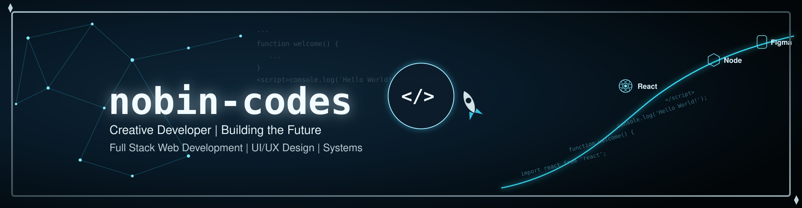

  

  

  

<h1 align="center">Hi 👋, I'm Kashif Akhter Nobin</h1>

<h3 align="center">
  Aspiring Developer | Learning Web Development & Programming
</h3>

  <em>Learning • Building • Practicing • Improving</em>

---

I'm an aspiring developer currently learning programming and web development. 
I enjoy building websites, exploring new technologies, and improving my development skills.

I also have experience with UI/UX design and enjoy combining design with development to create better digital experiences.

- 🔭 Currently focused on **Full Stack Web Development**
- 🌱 Currently learning **JavaScript, TypeScript, and React**
- 🧠 Strengthening my **programming fundamentals and problem-solving skills**
- 🛠️ Building **web projects** through hands-on practice
- 💡 Interested in **programming and building with code**
- 📍 Based in **Bangladesh**
- 🧑🏻‍💻 Student at <strong>Programming Hero</strong>  
---

🌐 Connect With Me

  &nbsp;  &nbsp;  

🛠️ Technology Stack
💻 Languages

  

⚛️ JavaScript Frameworks & Libraries

  

🧰 Tools & Technologies

  

🎨 Design

  

## 📚 Currently Learning

| Technology / Area | What I'm Learning |
| :--- | :--- |
| 🟨 **JavaScript** | Programming fundamentals & modern JavaScript |
| 🔷 **TypeScript** | Typed JavaScript & better code structure |
| ⚛️ **React** | Components, props, state & modern React |
| 🌐 **Full Stack Web Development** | Building toward frontend + backend development |
| 🧠 **Programming Fundamentals** | Logic, problem solving & core concepts |
| 📱 **Responsive Web Design** | Creating interfaces for different screen sizes |
| 🔧 **Git & GitHub** | Version control & project management |

---

## 🚀 What I'm Working On

I'm focused on **learning by building**.

### 🔥 Current Learning Path

<pre>
📖 Learn
   ↓
💻 Practice
   ↓
🧪 Experiment
   ↓
🐛 Debug
   ↓
🚀 Build
   ↓
📈 Improve
   ↓
🔄 Repeat
</pre>

Every project is an opportunity to learn something new and become a better developer.
 
## 🎨 UI/UX Design

I have experience in **UI/UX Design** and enjoy creating clean, intuitive, and user-friendly interfaces.

My design experience helps me think about both the **visual side** and the **user experience** when working on digital products.

### 🖌️ Design Interests

- 🎨 User Interface Design
- 🧠 User Experience
- 📱 Mobile & Web Interfaces
- 🖥️ Dashboard Design
- 🔗 Basic Prototyping
- 🧩 Layout & Visual Design

---

## 📂 Projects

### 🚀 Web DevConf 2026

A responsive web development conference landing page built as part of my web development learning journey.

### 💼 Nexa — Business Website

A modern business website built to showcase digital services and solutions as part of my web development learning journey.

### 💻 Practice Projects

Smaller projects and exercises created to strengthen my understanding of HTML, CSS, JavaScript, React, and modern web development.

> 🚧 More projects will be added as I continue learning and building.

---
## 📊 GitHub Stats

  
  

## ⚡ Quick Overview

| | |
| :--- | :--- |
| 👨‍💻 **Current Role** | Aspiring Developer |
| 🌐 **Current Focus** | Full Stack Web Development |
| 🟨 **Learning** | JavaScript |
| 🔷 **Learning** | TypeScript |
| ⚛️ **Learning** | React |
| 🎨 **Experience** | UI/UX Design |
| 🧰 **Tools** | Git, GitHub & VS Code |
| 🚀 **Approach** | Learn → Build → Improve |

---

<picture>
  <source media="(prefers-color-scheme: dark)" srcset="https://raw.githubusercontent.com/nobin-codes/nobin-codes/output/github-snake-dark.svg">
  <source media="(prefers-color-scheme: light)" srcset="https://raw.githubusercontent.com/nobin-codes/nobin-codes/output/github-snake.svg">
  
</picture>

  <strong>🚀 Keep Learning. Keep Building. Keep Improving.</strong>

  <em>Thanks for visiting my GitHub profile! 👋</em>

  

